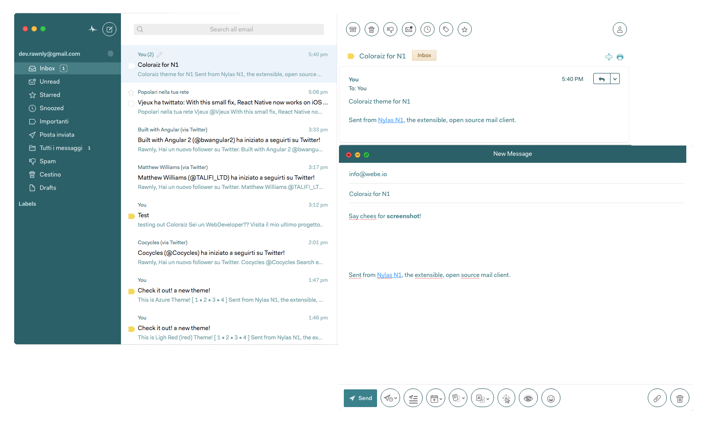

#Coloraiz Theme | N1
A Coloraiz.css theme for <a href="https://nylas.com/">Nylas N1</a>


##Change the color
Go to **```../styles/variables.less```** and at line 52 you can modify the var 
```less 
coloraiz-sidebar--default: @azure-3;
``` 
to one of this:

**Purple**
- @purple-1
- @purple-2
- @purple-3
 
**Light Red**
- @lred-1 
- @lred-2 
- @lred-3 
 
**Marine**
- @marine-1
- @marine-2
- @marine-3
 
**Gray**
- @gray-1 
- @gray-2 
- @gray-3 
 
**Green**
- @green-1 
- @green-2 
- @green-3 
 
**Azure**
- @azure-1 
- @azure-2 
- @azure-3 
 
**Light Gray**
- @lgray-1
- @lgray-2
- @lgray-3
 
**Blue**
- @blue-1 
- @blue-2
- @blue-3
 
**Orange**
- @orange-1
- @orange-2
- @orange-3
